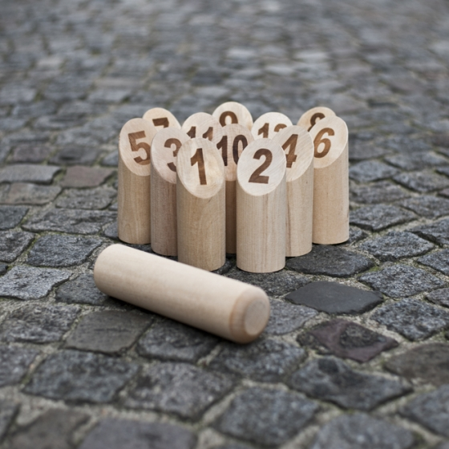

## Le Mölkky

Le jeu de Mölkky est composé de 12 quilles (12 pins) et d'un lanceur (le Mölkky).

### Les règles

Les joueurs jouent les uns après les autres.

Le joueur lance le Mölkky sur les quilles. S'il fait tomber une seule quille, il marque le nombre de points inscrit sur celle-ci. S'il en fait tomber plusieurs, son nombre de points est égal au nombre de quilles tombées.

La partie est remportée par le premier joueur qui atteint exactement 50. Si un joueur dépasse 50, il revient à 25.

Enfin, si un joueur A fait exactement le même score qu'un joueur B, alors le score du joueur B retombe à zéro.

Exemple :
 * Paul obtient un score de 3 au premier tour.
 * Geoffrey obtient un score de 8 au premier tour.
 * Paul fait tomber la quille 11 au second tour, son score est de 14.
 * Geoffrey fait tomber 6 quilles au second tour, son score est de 14, le même que Paul. Celui de Paul est donc maintenant à 0.
